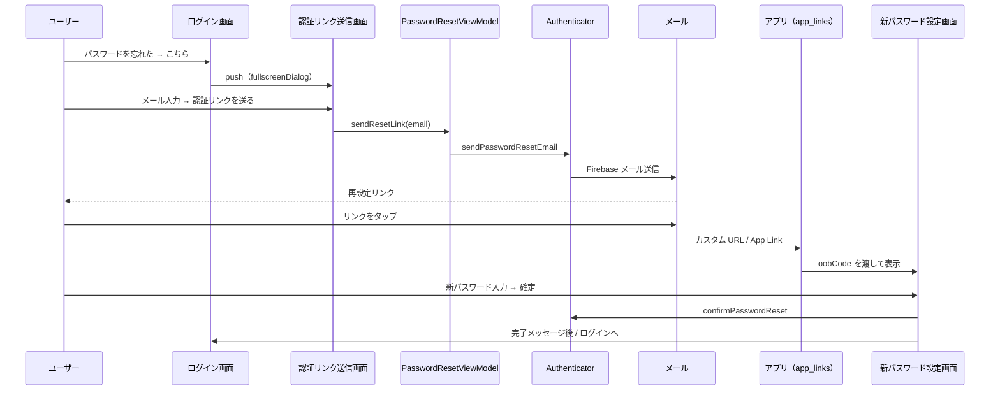

# パスワードリセット 実装計画 / Password Reset Implementation Plan

- **作成日**: 2026-05-23
- **ステータス**: 草案
- **関連 Issue**: [#17](https://github.com/a-utaya/kaimono-plus/issues/17)
- **関連 PR**: https://github.com/a-utaya/kaimono-plus/pull/37

---

## Summary (EN)

**Goal:** Let users who forgot their password request a reset link by email and set a new password after opening the link in the app.

**Approach:** Two screens (request link + set new password). Auth operations go through the shared [`Authenticator`](../../packages/core/auth/lib/src/authenticator.dart) abstraction (`FirebaseAuthenticator`), not direct `firebase_auth` calls in the app—matching the merged sign-in/sign-up refactor. Deep linking (`app_links` + `ActionCodeSettings` inside `FirebaseAuthenticator`) opens the in-app confirmation screen.

**Acceptance criteria (high level):**

- [ ] User can enter a registered email and tap “Send reset link” to receive the email
- [ ] Invalid email format and loading states are handled before/at send time
- [ ] Tapping the email link opens the app to the new-password screen
- [ ] New password meets the same rules as sign-up; user can sign in with the new password after reset

**Out of scope:** Email verification flows, production custom-domain setup for web, swapping the Firebase backend for another auth provider (the `Authenticator` interface should still allow it later).

---

## 1. 目的・背景

### なぜやるか

- パスワードを忘れたユーザーが、**登録済みメールアドレス**から安全にパスワードを再設定できるようにする

### 前提・制約

- 認証処理は **`Authenticator`** という共通の窓口にまとめ、中身は **`FirebaseAuthenticator`** が担当する
  - アプリ層（ViewModel）は `ref.read(authenticatorProvider)` 経由で呼び出す。
  - **`firebase_auth` / Firestore をアプリの ViewModel から直接 import しない**。
- UI は既存のログイン・新規登録画面に合わせる（`HookConsumerWidget` + Riverpod ViewModel、`showAppSnackBar`、`AppInputDecoration`）
- エラーメッセージの Firebase コード変換は **`FirebaseAuthenticator` 内**に集約し、ViewModel は `AuthException.message` を表示に使う（サインイン / サインアップと同様）

### スコープ外（今回やらないこと）

- メールアドレス変更・メール認証（サインアップ確認）フロー
- Web 向けの本番用カスタムドメイン設定の詳細運用（必要なら別タスク）
- `Authenticator` の Firebase 以外の実装（将来差し替え可能な設計に留める）

---

## 2. 実装概要

### ユーザーストーリー

1. ログイン画面の「パスワードを忘れた方は **こちら**」から **認証リンク送信画面** を開く。
2. 登録済みのメールアドレスを入力し、「**認証リンクを送る**」をタップする。
3. 入力したアドレスに **パスワード再設定用のリンク** が届く。
4. メール内のリンクをタップすると **アプリが起動**（またはフォアグラウンド復帰）し、**新パスワード入力画面** に遷移する。
5. 新しいパスワード（と確認用）を入力して確定すると、再設定完了。ログイン画面へ戻れる。

### 受け入れ条件

| # | 条件 |
| --- | --- |
| AC-1 | 有効なメール形式でない場合、送信前にバリデーションエラーを表示する |
| AC-2 | 「認証リンクを送る」押下で `Authenticator.sendPasswordResetEmail` が呼ばれ、成功時は案内メッセージを表示する（例：メールを確認してください） |
| AC-3 | 送信中はボタンを無効化し、ローディング表示する（サインイン / サインアップと同様） |
| AC-4 | メールのリンクからアプリが開いたとき、**新パスワード設定画面** が表示される |
| AC-5 | 認証リンク送信後10分が経過するとそのリンクは無効になり、メールのリンクからアプリを開くと、`PasswordResetPage` に「認証リンクの有効期限が切れています。再度リンクを送信してください。」のダイアログが表示される |
| AC-6 | 新パスワードはサインアップと同じルール（6 文字以上・英字・数字を各 1 文字以上、確認欄と一致） |
| AC-7 | 再設定成功後、ログイン画面で新パスワードでサインインできる |

### どのように実装するか

**レイヤー分担**

```text
[アプリ ViewModel]  →  authenticatorProvider  →  [Authenticator]
                                                      ↓
                                            [FirebaseAuthenticator]
                                              firebase_auth（送信・確定）
                                              ActionCodeSettings（アプリ内リンク）
[アプリ main / handler]  →  app_links（URI 受信・画面遷移のみ）
```

**2 画面 + ディープリンク** で構成する。

| 画面 | 役割 | 既存 / 新規 |
| --- | --- | --- |
| 認証リンク送信 | メール入力 → リンク送信 | 既存 `PasswordResetPage` を改修（`PasswordResetRequestPage`） |
| 新パスワード設定 | リンクの `oobCode` を使いパスワード確定 | **新規** `PasswordResetConfirmationPage` |
| 認証リンク次元切れダイアログ | リンクの 期限切れを知らせる | 既存 `PasswordResetRequestPage` に **新規** `MagicLinkExpiredDialog` |

**`Authenticator` に追加する API（想定）**

```dart
/// パスワード再設定メールを送信する
Future<void> sendPasswordResetEmail({required String email});

/// OOB コードの有効性を確認し、対象メールアドレスを返す（任意・UX 用）
Future<String> verifyPasswordResetCode(String code);

/// 新パスワードを確定する
// Firebase Authentication の Flutter SDK（firebase_auth）の confirmPasswordReset というメソッド名に合わせる
Future<void> confirmPasswordReset({
  required String code,
  required String newPassword,
});
```

実装は `FirebaseAuthenticator` 内で `sendPasswordResetEmail` / `verifyPasswordResetCode` / `confirmPasswordReset` をラップし、`FirebaseAuthException` を `AuthException` に変換する。`ActionCodeSettings`（`handleCodeInApp: true` 等）も **Firebase 実装側**で組み立てる。

**ディープリンク（アプリ層）**

- パッケージ `app_links` で起動時・復帰時の URI を受け取る。
- URI から `oobCode`（および `mode=resetPassword`）を取り出し、Confirm 画面へ `Navigator.push`。
- パスワード確定処理自体は ViewModel → `Authenticator` 経由。

**ViewModel のパターン**

- 送信画面・確定画面とも、**サインアップ**に近い形（入力バリデーションは ViewModel、認証処理は `Authenticator`、`AuthException.message` を SnackBar 表示）を基本とする。
- サインインの `AsyncValue.guard` パターンでもよいが、同一機能内で 1 パターンに揃える。

**採用しなかった案**

| 案 | 見送り理由 |
| --- | --- |
| ViewModel から `FirebaseAuth.instance` を直接呼ぶ | `auth` パッケージは認証機能を閉じ込めるため。アプリ層では `firebase_auth` を直接使わず、`Authenticator` 経由で呼ぶ |
| Firebase ホストの Web ページのみで完結 | 要件どおりアプリ内の再設定画面へ遷移させるため |
| 1 画面にメール送信と新パスワード入力をまとめる | リンク到達前は `oobCode` がないため UX・状態管理が複雑になる |

### 画面遷移（概要）



### 影響範囲（パッケージ・レイヤー）

| 対象 | 変更の有無 | メモ |
| --- | --- | --- |
| `packages/core/auth` | **あり** | `Authenticator` API 追加、`FirebaseAuthenticator` 実装、エラー変換、テスト |
| `packages/apps/kaimono_plus` | **あり** | 画面 2、ViewModel 2、ディープリンク、ネイティブ設定 |
| Firebase コンソール | **あり** | メールテンプレート・承認ドメイン・Action URL |
| `docs/navigation.md` | あり（推奨） | 画面遷移図の追記 |

### 使用パッケージ

| パッケージ | 新規 / 既存 | 追加先 | 用途 | リンク |
| --- | --- | --- | --- | --- |
| `auth` | 既存 | apps（依存）/ `core/auth` | `Authenticator` 経由で認証処理を呼ぶ | [`packages/core/auth`](../../packages/core/auth) |
| `firebase_auth` | 既存 | `core/auth` | メール送信・OOB コード検証・パスワード確定（`FirebaseAuthenticator` 内） | [firebase_auth](https://pub.dev/packages/firebase_auth) |
| `hooks_riverpod` | 既存 | apps | ViewModel | [hooks_riverpod](https://pub.dev/packages/hooks_riverpod) |
| `riverpod_annotation` | 既存 | apps | ViewModel（コード生成） | [riverpod_annotation](https://pub.dev/packages/riverpod_annotation) |
| `design_system` | 既存 | apps | 入力欄・テーマ | [`packages/design_system`](../../packages/design_system) |
| **`app_links`** | **新規（Phase 2 以降）** | apps | メールリンクからアプリ起動・URI 受信 | [app_links](https://pub.dev/packages/app_links) |

> Phase 1（認証リンク送信画面のみ）では `app_links` は不要。ディープリンク PR で追加する。

---

## 3. タスク一覧

### 準備

- [ ] Firebase コンソールで「パスワード再設定」メールテンプレートと **承認済みドメイン** を確認
- [ ] 再設定リンク用の **続行 URL**（例：`https://kaimono-plus.firebaseapp.com/__/auth/action` またはアプリ用カスタム URL）を決める
- [ ] Android App Links / iOS Universal Links（またはカスタム URL スキーム）の方針を決める

### 実装（`packages/core/auth`）

- [ ] `Authenticator` に `sendPasswordResetEmail` / `verifyPasswordResetCode` / `confirmPasswordReset` を追加
- [ ] `FirebaseAuthenticator` に実装を追加（`ActionCodeSettings` 含む）
- [ ] パスワードリセット用の `_passwordResetErrorMessage` を追加（`AuthException` に変換）
- [ ] `packages/core/auth` のテストを追加（エラーメッセージ変換、可能ならモックによる API 呼び出し）

### 実装（`packages/apps/kaimono_plus`）

- [ ] `password_reset_page_view_model.dart` を追加（`authenticatorProvider` 経由で送信、メールバリデーション）
- [ ] `PasswordResetPage` を改修（`HookConsumerWidget` 化、ボタン文言「**認証リンクを送る**」、送信成功時の UX）
- [ ] `password_reset_confirm_page.dart` + ViewModel を新規作成（`confirmPasswordReset` を `authenticatorProvider` 経由で呼ぶ）
- [ ] `pubspec.yaml` に `app_links` を追加し、起動時リンク処理を `main.dart`（または専用 handler）に実装
- [ ] Android `AndroidManifest.xml` / iOS `Info.plist` に intent-filter・URL スキームを追加
- [ ] パスワードバリデーションはサインアップ ViewModel と同ルール（重複が大きければ共通化を検討）

### 品質

- [ ] `cd packages/core/auth && flutter test`
- [ ] `cd packages/apps/kaimono_plus && flutter analyze`
- [ ] アプリ ViewModel の単体テスト（バリデーション、`AuthException` の表示変換）
- [ ] 実機またはエミュレータで E2E 手動確認（下記テスト計画）

### 仕上げ

- [ ] `docs/navigation.md` に画面遷移を追記
- [ ] PR 作成（UI スクショ：送信画面・メール送信後・新パスワード画面）

---

## 4. 実装詳細（レビュー用）

### 新規作成（`packages/core/auth`）

| パス | 種別 | 役割 |
| --- | --- | --- |
| `lib/src/authenticator.dart` | 抽象 API | 上記 3 メソッドのシグネチャ追加 |
| `lib/src/firebase/firebase_authenticator.dart` | 実装 | Firebase Auth 呼び出し、`ActionCodeSettings`、エラー変換 |
| `test/firebase_authenticator_password_reset_test.dart`（名称調整可） | テスト | エラーコード → 日本語メッセージ等 |

### 新規作成（`packages/apps/kaimono_plus`）

| パス | 種別 | 役割 |
| --- | --- | --- |
| `lib/pages/password_reset_page/password_reset_page_view_model.dart` | ViewModel | メール送信・ローディング・`AuthException` ハンドリング |
| `lib/pages/password_reset_page/password_reset_page_view_model.g.dart` | 生成 | `build_runner` |
| `lib/pages/password_reset_confirm_page/password_reset_confirm_page.dart` | Page | 新パスワード・確認入力 UI |
| `lib/pages/password_reset_confirm_page/password_reset_confirm_page_view_model.dart` | ViewModel | 確定処理を `authenticatorProvider` 経由で実行 |
| `lib/pages/password_reset_confirm_page/password_reset_confirm_page_view_model.g.dart` | 生成 | `build_runner` |
| `lib/auth/password_reset_link_handler.dart`（名称調整可） | Handler | `app_links` で URI を受け、Confirm 画面へ遷移 |

### 既存ファイルの変更

| パス | 変更内容 |
| --- | --- |
| `packages/core/auth/lib/src/authenticator.dart` | パスワードリセット API 3 件を追加 |
| `packages/core/auth/lib/src/firebase/firebase_authenticator.dart` | 上記 API の Firebase 実装 |
| `lib/pages/password_reset_page/password_reset_page.dart` | `HookConsumerWidget` 化、ViewModel 接続、ボタン「認証リンクを送る」 |
| `lib/pages/sign_in_page/sign_in_page.dart` | 遷移は現状の `push` + `fullscreenDialog` のまま（変更不要の想定） |
| `lib/main.dart` | ディープリンクの初期 URI 購読、Confirm 画面へのナビゲーション用 `navigatorKey` 検討 |
| `pubspec.yaml` | `app_links` 追加 |
| `android/app/src/main/AndroidManifest.xml` | ディープリンク用 `intent-filter` |
| `ios/Runner/Info.plist` | URL タイプ / Associated Domains（方針に応じて） |

### API・インターフェース

**アプリが呼ぶ API（`Authenticator`）**

| メソッド | 呼び出し元 | 概要 |
| --- | --- | --- |
| `sendPasswordResetEmail({required String email})` | `PasswordResetPageViewModel` | 認証リンク付きメール送信 |
| `verifyPasswordResetCode(String code)` | `PasswordResetConfirmPageViewModel`（任意） | リンク有効性・メールアドレス表示用 |
| `confirmPasswordReset({required String code, required String newPassword})` | 同上 | 新パスワードの確定 |

**Firebase 実装内（アプリからは不可視）**

| 内部利用 | 概要 |
| --- | --- |
| `FirebaseAuth.sendPasswordResetEmail` + `ActionCodeSettings` | メール送信 |
| `FirebaseAuth.verifyPasswordResetCode` | コード検証 |
| `FirebaseAuth.confirmPasswordReset` | パスワード更新 |

### 画面・ナビゲーション

| 項目 | 内容 |
| --- | --- |
| **認証リンク送信** | |
| 遷移元 | `SignInPage` → 「パスワードを忘れた方は こちら」 |
| 遷移先 | 成功後は `pop` + SnackBar、または送信完了の簡易表示 |
| **新パスワード設定** | |
| 遷移元 | メールリンク（ディープリンク）／コールドスタート時は `main` 経由 |
| 遷移先 | 完了後 `SignInPage`（未ログインの `_AuthGate` 経由） |
| パラメータ | `oobCode`（必須）、必要なら `email`（`verifyPasswordResetCode` の結果） |

### UI 文言（想定）

| 画面 | 要素 | 文言 |
| --- | --- | --- |
| 送信 | タイトル | パスワード再設定（現状維持可） |
| 送信 | 説明（任意） | 登録済みのメールアドレスに認証リンクを送ります |
| 送信 | ボタン | **認証リンクを送る** |
| 確定 | タイトル | 新しいパスワードの設定 |
| 確定 | ボタン | パスワードを変更する |

### データ・外部連携

- **Firebase Authentication**: メール送信・OOB コード検証・パスワード更新（`FirebaseAuthenticator` 経由のみ）
- **Firestore**: 変更なし（パスワードのみ Auth 側で更新）
- **Firebase コンソール**: Authentication → テンプレート（パスワード再設定）、Settings → Authorized domains

### エラーメッセージ（想定）

`FirebaseAuthenticator` 内で `AuthException` に変換する（ViewModel は `e.message` を表示）。

| Firebase コード | 表示例 |
| --- | --- |
| `invalid-email` | メールアドレスの形式が正しくありません |
| `user-not-found` | ※セキュリティ上、送信成功と同じ文言にする方針も可 |
| `expired-action-code` | リンクの有効期限が切れています。再度認証リンクを送信してください |
| `invalid-action-code` | リンクが無効です。再度お試しください |
| `weak-password` | パスワードは6文字以上の英数字（英字と数字の両方を含む）で設定してください |

---

## 5. テスト計画

| 種別 | 内容 | コマンド / 手順 |
| --- | --- | --- |
| 静的解析 | アプリ全体 | `cd packages/apps/kaimono_plus && flutter analyze` |
| 単体テスト（auth） | `FirebaseAuthenticator` のエラー変換等 | `cd packages/core/auth && flutter test` |
| 単体テスト（app） | ViewModel のバリデーション | `cd packages/apps/kaimono_plus && flutter test` |
| 手動（送信） | 1. ログイン → パスワード忘れ 2. 登録済みメール入力 3. 送信 4. メール受信確認 | 実機推奨 |
| 手動（確定） | 1. メールのリンクタップ 2. アプリで新パスワード画面表示 3. 新パスワード設定 4. ログイン成功 | 実機推奨 |
| 手動（異常） | 未登録メール、形式不正、期限切れリンク、パスワード不一致 | 同上 |

---

## 6. リスク・未決事項

- [ ] **ディープリンク URL の最終形**（Firebase デフォルトドメイン vs 独自ドメイン）— 実装前に 1 つに固定する
- [ ] **iOS シミュレータ / Android エミュレータ**でメールリンクがアプリを開けるか（実機テストが必要な場合あり）
- [ ] メール内リンクが **ブラウザ** で開いてしまう場合のフォールバック（Associated Domains 未設定など）
- [ ] `user-not-found` 時に「送信しました」と表示するか（アカウント列挙対策）— プロダクト方針で決定

---

## 7. レビュー用メモ

- **重点的に見てほしい箇所**:
  - `Authenticator` API の責務分割（Firebase 詳細がアプリに漏れていないか）
  - `ActionCodeSettings` とネイティブ manifest の対応
  - `main` でのディープリンクと `Navigator` の扱い（コールドスタート）
- **意図的に今回やらないこと**: Web 専用フローの完成、Firebase 以外の Authenticator 実装
- **参考リンク**:
  - [Firebase - メールアクションをアプリで処理する](https://firebase.google.com/docs/auth/flutter/passing-state-in-email-actions)
  - [firebase_auth - sendPasswordResetEmail](https://pub.dev/documentation/firebase_auth/latest/firebase_auth/FirebaseAuth/sendPasswordResetEmail.html)
  - [firebase_auth - confirmPasswordReset](https://pub.dev/documentation/firebase_auth/latest/firebase_auth/FirebaseAuth/confirmPasswordReset.html)

---

## 更新履歴

| 日付 | 変更内容 |
| --- | --- |
| 2026-05-23 | 初版作成 |
